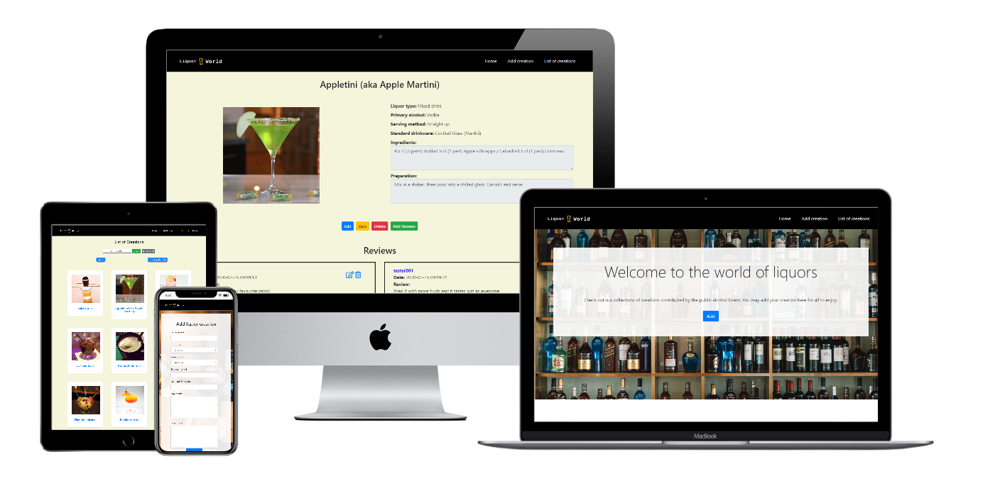

# Liquor World
## Data Centric Development Milestone Project

### **Introduction**
There are many different types of liquor mixes, each with its own unique name and preparation method. 
For all liquor lovers, bartenders, pub owners and many more, this website allows them to share their creations 
or concoct the drinks per their client's request if they are able to find the requested liquor here.
The users are able to add, update, or delete their creation here, as well as add, update or delete reviews.
 
The link is as follows: [Liquor_world](https://ojhj-project3.herokuapp.com/)
***

### **User Experience (UX)**
**User stories** 

For someone who wanted to try different sorts of mixes, I want to:
- Be able to navigate freely and easily
- Able to search for what i want easily
- Be able to add reviews or feedbacks

For someone who is a liquor guru, I want to:
- Be able to share my creations easily
- Be able to edit my creations easily
- Be able to delete my creations easily
- Be able to look at the reviews and reply

For bartenders/pub owners etc, I want to:
- Be able to search for the liquor easily should customer request
- Be able to easily view the details and preparation method

**Some UX considerations**
- The navbar at the top is found on every page, for easy navigation. 
- Adding and upload of image is made simple with clear instructions.
- Images are fixed into squares to make the page looks neat
- Hovering above the selected image will show a prominent pop-up for user
- Back buttons are added to allow users to return should no actions to be made
- Alert messages are prompted should users want to delete
- Flash messages are added after an action is executed
- Easy search filter by categories or name search provided

### **UI**
- Navbar is presented on every page, with the website logo. 
#### Home page
- A simple navbar for users to navigate and a jumbotron with an add button
#### Edit liquor page
- Page is divided cleanly in half, with details to be added on left and image to be uploaded on right. 
Image uploaded will be shown which explains the space.
- Submit and add button at the bottom for execution
#### Liquor listing page
- Name filter and category filter is found and can be used
- Reset search button to clear search results and display all items
- Cards are arranged neatly in 3 columns and images are made squared for neatness
#### Liquor details page
- Image name will be displayed to indicate which liquor user is at
- A larger image of the liquor is displayed on the left with its details on the right
- Information here are all read only
- Reviews of the liquor are displayed below
- Buttons to edit or delete the liquor are presented on this page
- Add review button is available here as well for users to add their reviews
- The reviews are presented in boxes, with their respective details
- Edit or delete for reviews are indicated with the edit or delete symbols
#### Add review page
- User can input their username and comment here
- Date is tracked separately the moment submit button is clicked
#### Edit review page
- The username and date will not be shown or allowed to edit
- Only comments can be edited
#### Delete liquor/review page
- Prompt whether to proceed or cancel to return to previous page
***
### **Technologies used**
- HTML
- CSS
- Python
- Bootstrap (4.4.1)
- Fontawesome
- Cloudinary to store and import files to MongoDB
- Flask with Jinja2
- Pymongo
- MongoDB as the noSQL database
***
### **Testing**
The test site is tested to be responsive for:
- iphone 4
- galaxy s5
- iphone 5/se
- iphone 6/7/8
- iphone 6/7/8 plus
- iphone X
- ipad
- ipad pro
- google chrome
- microsoft edge
- safari
- internet explorer

Basic checks include:
- Testing that the C(Create), R(Read), U(Update), D(Delete) functions for liquor and reviews are working
- Checking that the filter for both name search and category search are working
- Testing that the navbar link categories are working
- Testing that the read only fields cannot be edited
- Testing that the route for all buttons are set correctly and working fine

Known errors:
- If updating on liquor details, need to reupload the image again
- Time saved at review paged is in UTC (Coordinated Universal Time)

Features left to implement:
- User logins and logouts
- Editing feature to be limited to what user input only
- Replies to comments/reviews
- Advanced filter options
***
### **Deployment**
The code is written using gitpod and pushed to github. Since Flask and Mongo is being used, deployment is 
done with the help of Heroku and pushed to Heroku Master as well.
***
### **Credits**
- Site images are taken from [unsplash.com](https://unsplash.com/)
- Liquor images and details are taken from [wikipedia](https://en.wikipedia.org/wiki/List_of_cocktails)
- Icons are taken from [fontawesome](https://fontawesome.com/)
- Logo is made using [hatchful](https://hatchful.shopify.com/)
- Colour gradient is taken from [webgradients](https://webgradients.com/)
- Mock up is obtained from [mockup_generator](https://techsini.com/multi-mockup/index.php)

*Site is strictly for educational purposes

